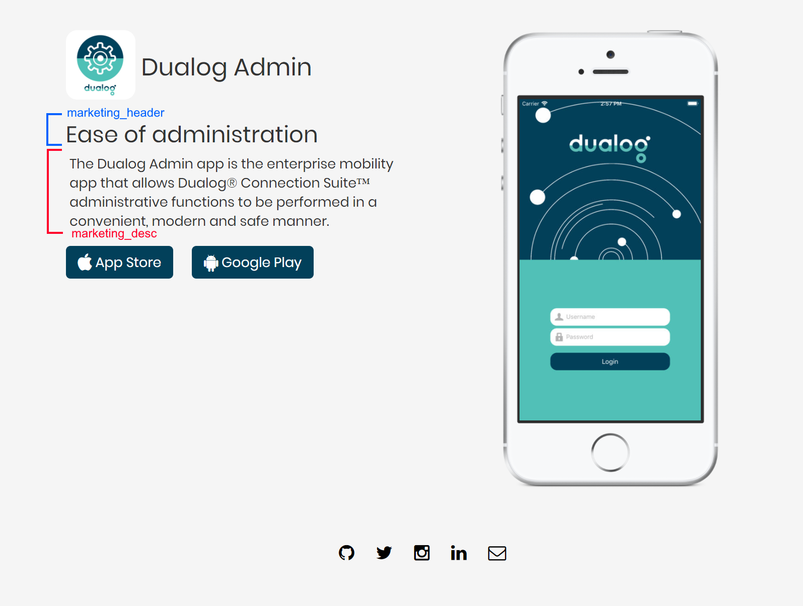

# Dualog App landing page

A simple and static landing page template for apps using [Jekyll](https://jekyllrb.com/), [Bootstrap](https://getbootstrap.com/), [FontAwesome](https://fontawesome.com/), [Sass](https://sass-lang.com/) and [GitHub Pages](https://pages.github.com/).



## Getting started
Fork the repo and edit `_config.yml` and then activate GitHub Pages in the repo settings.
This project depends on Ruby and github-pages gem. 

### **1. Installing Ruby and dependencies:**

For Windows (using Chocolatey package manager):
```
$ choco install ruby
```

For macOS (using Homebrew package manager):
```
$ brew install ruby
```

For Ubuntu (using apt):

```
$ sudo apt-get install ruby-full
``` 

After installing please verify the version by running:

```
$ ruby -v
ruby 2.5.1p57 (2018-03-29 revision 63029) [x64-mingw32] 
```

Life should be great right now, install the project dependencies
```
$ gem install github-pages
```

### **2. Running the project**
Clone the forked repository to your computer
```
$ git clone https://github.com/username/landingpage-apps.git
$ cd landingpage-apps
$ jekyll serve
```
The site should now be served on http://localhost:4000 and it should be listening for changes in your markup.